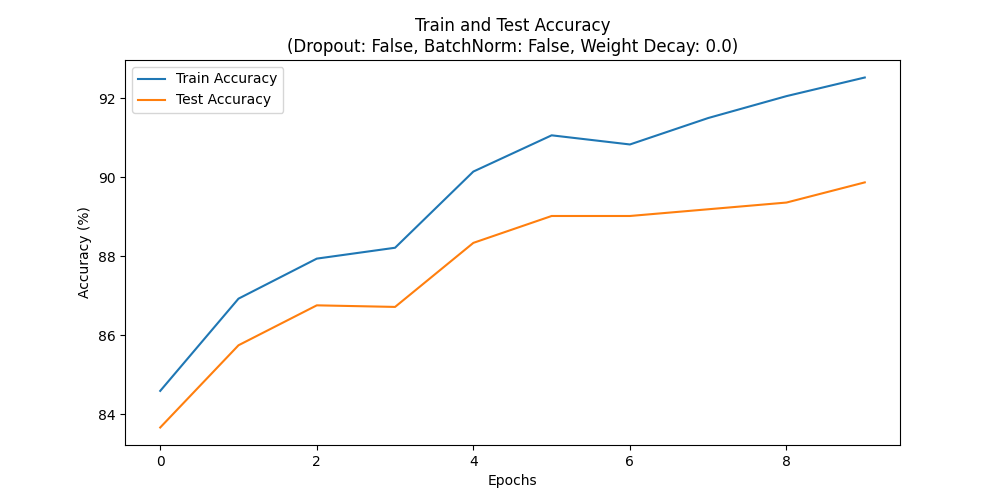

<table border="1" cellpadding="5" cellspacing="0">
  <tr>
    <th>Regularization Method</th>
    <th>Final Train Accuracy</th>
    <th>Final Validation Accuracy</th>
    <th>Final Test Accuracy</th>
  </tr>
  <tr>
    <td>Dropout</td>
    <td>89.14%</td>
    <td>88.43%</td>
    <td>87.26%</td>
  </tr>
  <tr>
    <td>Batchnorm</td>
    <td>94.60%</td>
    <td>90.42%</td>
    <td>89.58%</td>
  </tr>
  <tr>
    <td>Weight Decay</td>
    <td>91.62%</td>
    <td>89.28%</td>
    <td>88.98%</td>
  </tr>
  <tr>
    <td>No Regularization</td>
    <td>92.12%</td>
    <td>90.12%</td>
    <td>89.34%</td>
  </tr>
</table>