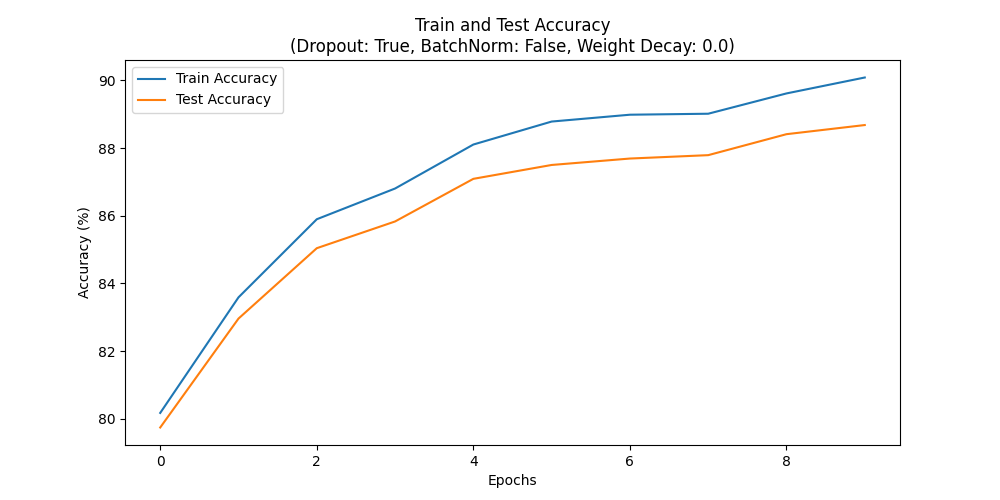

# LeNet-5 FashionMNIST Experiment

This repository contains an implementation of the LeNet-5 neural network, modified to work with the FashionMNIST dataset. The code supports various regularization techniques such as Dropout, Batch Normalization, and L2 Regularization (Weight Decay). This README provides instructions on how to set up, run, and experiment with different regularization techniques.

## Setup

### 1. Clone the Repository

Clone this repository to your local machine using the following command:

```bash
git clone https://github.com/Selinali01/deeplearning_hw0.git
```

### 2. Install Dependencies

```bash
pip install -r requirements.txt
```

### 3. Running the Default Configuration (No Regularization)
By default, the code runs without any regularization techniques. You can run the code as follows:
```bash
python code/main.py
```
### 4. Running Different Regularization Techniques
You can run the code with different regularization techniques by modifying parameters in main.py. Follow the instructions below to enable each regularization method.
#### 1. Dropout Regularization 
To enable Dropout, set the use_dropout variable to True in main.py:
```bash
use_dropout = True
python code/main.py
```
#### 2. Batch Normalization 
To enable Batch Normalization, set the use_batchnorm variable to True in main.py:
```bash
use_batchnorm = True
python code/main.py
```
#### 3.  L2 Regularization (Weight Decay)
To enable L2 Regularization, set the weight_decay parameter to a non-zero value (In our case, we use 0.0001) in main.py:
```bash
weight_decay = 0.0001
python code/main.py
```
### 5. Results 
The model generates accuracy graphs for both training and testing datasets across epochs for each regularization technique.
4 graphs will be produced (training and testing accuracy for each technique) and saved to the results directory.




<table border="1" cellpadding="5" cellspacing="0">
  <tr>
    <th>Regularization Method</th>
    <th>Final Train Accuracy</th>
    <th>Final Validation Accuracy</th>
    <th>Final Test Accuracy</th>
  </tr>
  <tr>
    <td>Dropout</td>
    <td>90.09%</td>
    <td>89.17%</td>
    <td>88.68%</td>
  </tr>
  <tr>
    <td>Batchnorm</td>
    <td>94.52%</td>
    <td>89.98%</td>
    <td>89.51%</td>
  </tr>
  <tr>
    <td>Weight Decay</td>
    <td>91.25%</td>
    <td>88.97%</td>
    <td>88.36%</td>
  </tr>
  <tr>
    <td>No Regularization</td>
    <td>92.52%</td>
    <td>90.50%</td>
    <td>89.87%</td>
  </tr>
</table>
